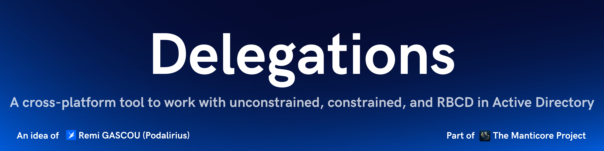

<p align="center">
      Delegations is a tool that allows you to work with all types of Kerberos delegations (unconstrained, constrained, and resource-based constrained delegations) in Active Directory.
      <br>
      <a href="https://github.com/TheManticoreProject/Delegations/actions/workflows/release.yaml" title="Build"></a>
      
      
      <a href="https://twitter.com/intent/follow?screen_name=podalirius_" title="Follow"></a>
      <a href="https://www.youtube.com/c/Podalirius_?sub_confirmation=1" title="Subscribe"></a>
      <br>
</p>

## Features

- [x] Audit mode:
  - [x] Audit existing unconstrained delegations
  - [x] Audit existing constrained delegations with or without protocol transition
  - [x] Audit existing resource-based constrained delegations
- [x] Add mode:
  - [x] Add new unconstrained delegations
  - [x] Add new constrained delegations with or without protocol transition
  - [x] Add new resource-based constrained delegations
- [x] Find mode:
  - [x] Find unconstrained delegations
  - [x] Find constrained delegations with or without protocol transition
  - [x] Find resource-based constrained delegations
- [x] Clear mode:
  - [x] Clear existing unconstrained delegations
  - [x] Clear existing constrained delegations with or without protocol transition
  - [x] Clear existing resource-based constrained delegations
- [x] Remove mode:
  - [x] Remove existing unconstrained delegations
  - [x] Remove existing constrained delegations with or without protocol transition
  - [x] Remove existing resource-based constrained delegations
- [x] Monitor mode:
  - [x] Monitor modifications of all types of delegations in real-time
- [x] Protocol transition mode:
  - [x] Add protocol transition on a constrained delegation
  - [x] Remove protocol transition on a constrained delegation

## Installation

To get this tool you can either download the latest release from the [GitHub release page](https://github.com/TheManticoreProject/Delegations/releases) or install it with the following `go` command:

```bash
go install github.com/TheManticoreProject/Delegations@latest
```

## Demonstration

<details open>
<summary><b>Audit Mode</b></summary>

The audit mode allows you to scan your Active Directory environment for all types of delegations:

```bash
./Delegations audit --dc-ip "192.168.56.101" -d "MANTICORE.local" -u "Administrator" -p "Admin123!"
```

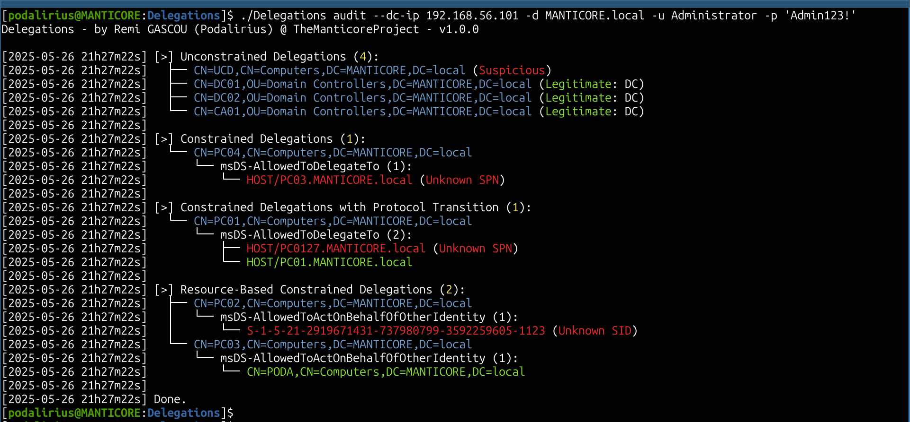

</details>


<details>
<summary><b>Add Mode</b></summary>

The add mode allows you to add a constrained, unconstrained, or resource-based constrained delegation on an object:

```bash
./Delegations add constrained --distinguished-name "CN=PC01,CN=Computers,DC=MANTICORE,DC=local" --dc-ip "192.168.56.101" -d "MANTICORE.local" -u "Administrator" -p 'Admin123!' --allowed-to-delegate-to "HOST/PC02.MANTICORE.local"
```

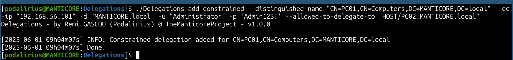

```bash
./Delegations add constrained --distinguished-name "CN=PC01,CN=Computers,DC=MANTICORE,DC=local" --dc-ip "192.168.56.101" -d "MANTICORE.local" -u "Administrator" -p 'Admin123!' --allowed-to-delegate-to "HOST/PC02.MANTICORE.local" --with-protocol-transition
```

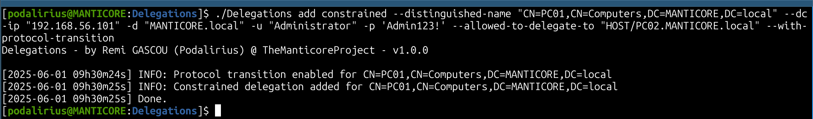


```bash
./Delegations add unconstrained --distinguished-name "CN=PC01,CN=Computers,DC=MANTICORE,DC=local" --dc-ip "192.168.56.101" -d "MANTICORE.local" -u "Administrator" -p 'Admin123!'
```

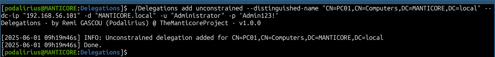

```bash
./Delegations add rbcd --distinguished-name "CN=PC01,CN=Computers,DC=MANTICORE,DC=local" --dc-ip "192.168.56.101" -d "MANTICORE.local" -u "Administrator" -p 'Admin123!'
```

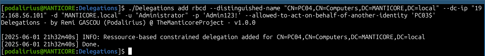

</details>


<details>
<summary><b>Clear Mode</b></summary>

The clear mode allows you to clear a constrained, unconstrained, or resource-based constrained delegation on an object:

```bash
./Delegations clear constrained --distinguished-name "CN=PC01,CN=Computers,DC=MANTICORE,DC=local" --dc-ip "192.168.56.101" -d "MANTICORE.local" -u "Administrator" -p 'Admin123!'
```

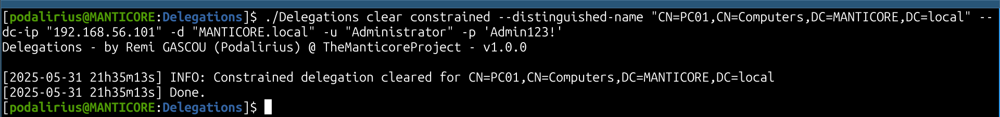

```bash
./Delegations clear constrained --distinguished-name "CN=PC01,CN=Computers,DC=MANTICORE,DC=local" --dc-ip "192.168.56.101" -d "MANTICORE.local" -u "Administrator" -p 'Admin123!' --with-protocol-transition
```

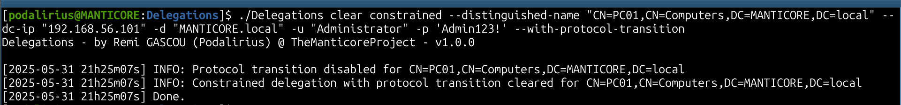

```bash
./Delegations clear unconstrained --distinguished-name "CN=PC01,CN=Computers,DC=MANTICORE,DC=local" --dc-ip "192.168.56.101" -d "MANTICORE.local" -u "Administrator" -p 'Admin123!'
```

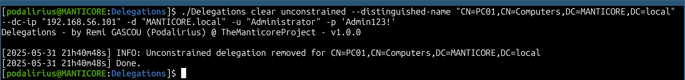

```bash
./Delegations clear rbcd --distinguished-name "CN=PC01,CN=Computers,DC=MANTICORE,DC=local" --dc-ip "192.168.56.101" -d "MANTICORE.local" -u "Administrator" -p 'Admin123!'
```

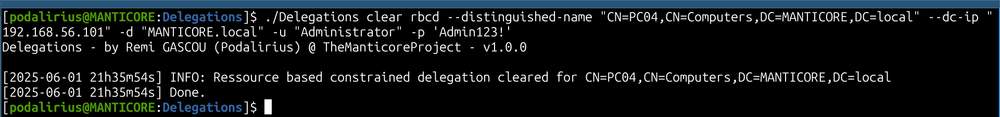

</details>


<details>
<summary><b>Find Mode</b></summary>

The find mode allows you to find a constrained, unconstrained, or resource-based constrained delegation on an object:

```bash
./Delegations find constrained --distinguished-name "CN=PC01,CN=Computers,DC=MANTICORE,DC=local" --dc-ip "192.168.56.101" -d "MANTICORE.local" -u "Administrator" -p 'Admin123!'
```

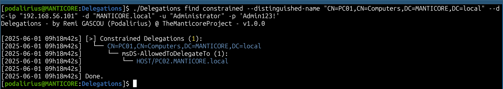

```bash
./Delegations find constrained --distinguished-name "CN=PC01,CN=Computers,DC=MANTICORE,DC=local" --dc-ip "192.168.56.101" -d "MANTICORE.local" -u "Administrator" -p 'Admin123!' --with-protocol-transition
```

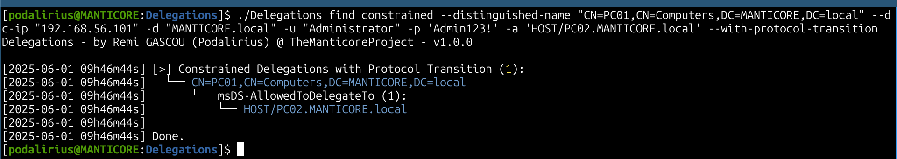


```bash
./Delegations find unconstrained --distinguished-name "CN=PC01,CN=Computers,DC=MANTICORE,DC=local" --dc-ip "192.168.56.101" -d "MANTICORE.local" -u "Administrator" -p 'Admin123!'
```

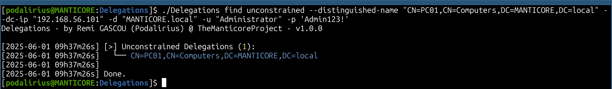

```bash
./Delegations find rbcd --distinguished-name "CN=PC01,CN=Computers,DC=MANTICORE,DC=local" --dc-ip "192.168.56.101" -d "MANTICORE.local" -u "Administrator" -p 'Admin123!'
```

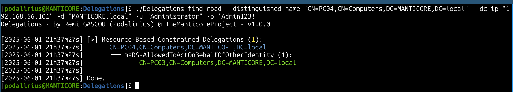

</details>


<details>
<summary><b>Remove Mode</b></summary>

The remove mode allows you to remove a constrained, unconstrained, or resource-based constrained delegation from an object:

```bash
./Delegations remove constrained --distinguished-name "CN=PC01,CN=Computers,DC=MANTICORE,DC=local" --dc-ip "192.168.56.101" -d "MANTICORE.local" -u "Administrator" -p 'Admin123!' --allowed-to-delegate-to "HOST/PC02.MANTICORE.local"
```

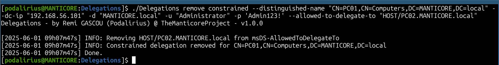

```bash
./Delegations remove constrained --distinguished-name "CN=PC01,CN=Computers,DC=MANTICORE,DC=local" --dc-ip "192.168.56.101" -d "MANTICORE.local" -u "Administrator" -p 'Admin123!' --allowed-to-delegate-to "HOST/PC02.MANTICORE.local" --with-protocol-transition
```

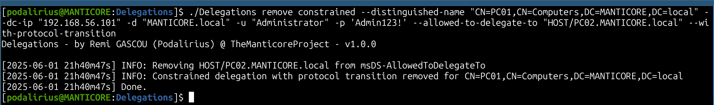

```bash
./Delegations remove unconstrained --distinguished-name "CN=PC01,CN=Computers,DC=MANTICORE,DC=local" --dc-ip "192.168.56.101" -d "MANTICORE.local" -u "Administrator" -p 'Admin123!'
```

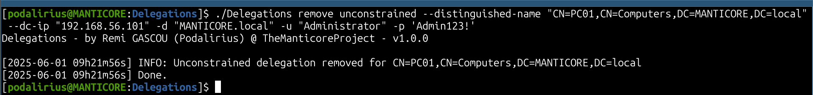

```bash
./Delegations remove rbcd --distinguished-name "CN=PC01,CN=Computers,DC=MANTICORE,DC=local" --dc-ip "192.168.56.101" -d "MANTICORE.local" -u "Administrator" -p 'Admin123!'
```

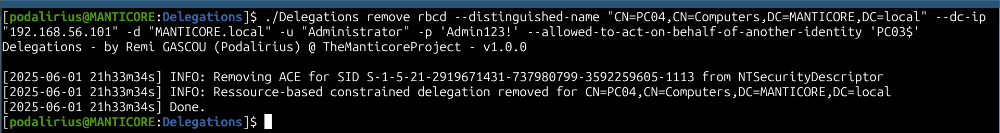
</details>


<details>
<summary><b>Protocol Transition Mode</b></summary>

The protocol transition mode allows you to add or remove protocol transition for a constrained delegation on an object:

```bash
./Delegations add protocoltransition --distinguished-name "CN=PC01,CN=Computers,DC=MANTICORE,DC=local" --dc-ip "192.168.56.101" -d "MANTICORE.local" -u "Administrator" -p 'Admin123!'
```

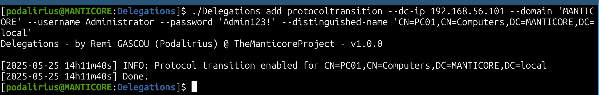

```bash
./Delegations remove protocoltransition --distinguished-name "CN=PC01,CN=Computers,DC=MANTICORE,DC=local" --dc-ip "192.168.56.101" -d "MANTICORE.local" -u "Administrator" -p 'Admin123!'
```

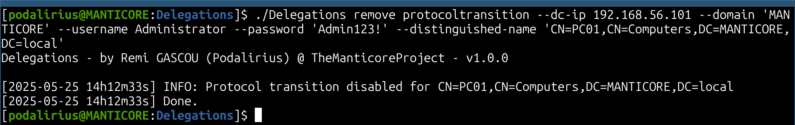

</details>


## Usage

The first positional argument of the program is the mode:

```
./Delegations 
Delegations - by Remi GASCOU (Podalirius) @ TheManticoreProject - v1.0.0

Usage: Delegations <add|audit|clear|find|monitor|remove>

   add      Add a constrained, unconstrained, or resource-based constrained delegation to a user or group.
   audit    Audit constrained, unconstrained, and resource-based constrained delegations in Active Directory.
   clear    Clear a constrained, unconstrained, or resource-based constrained delegation from a user or group.
   find     Find a constrained, unconstrained, or resource-based constrained delegation from a user or group.
   monitor  Monitor constrained, unconstrained, and resource-based constrained delegations in Active Directory.
   remove   Remove a constrained, unconstrained, or resource-based constrained delegation from a user or group.
```

Then for modes `add`, `remove` and `find`, the second positional argument is the delegation type:

```
./Delegations add 
Delegations - by Remi GASCOU (Podalirius) @ TheManticoreProject - v1.0.0

Usage: Delegations add <constrained|rbcd|unconstrained>

   constrained    Add a constrained delegation to a user or group.
   unconstrained  Add a unconstrained delegation to a user or group.
   rbcd           Add a ressource-based delegation to a user or group.

```

For mode `audit` all delegation types are audited at once, no more positional arguments are needed, only options:

```
./Delegations audit
Delegations - by Remi GASCOU (Podalirius) @ TheManticoreProject - v1.0.0

Usage: Delegations audit --domain <string> --username <string> [--password <string>] [--hashes <string>] [--debug] --dc-ip <string> [--ldap-port <tcp port>] [--use-ldaps] [--use-kerberos]


  Authentication:
    -d, --domain <string>   Active Directory domain to authenticate to.
    -u, --username <string> User to authenticate as.
    -p, --password <string> Password to authenticate with. (default: "")
    -H, --hashes <string>   NT/LM hashes, format is LMhash:NThash. (default: "")

  Configuration:
    -d, --debug     Debug mode. (default: false)

  LDAP Connection Settings:
    -dc, --dc-ip <string>       IP Address of the domain controller or KDC (Key Distribution Center) for Kerberos. If omitted, it will use the domain part (FQDN) specified in the identity parameter.
    -lp, --ldap-port <tcp port> Port number to connect to LDAP server. (default: 389)
    -L, --use-ldaps             Use LDAPS instead of LDAP. (default: false)
    -k, --use-kerberos          Use Kerberos instead of NTLM. (default: false)
```

## Contributing

Pull requests are welcome. Feel free to open an issue if you want to add other features.

## Credits
  - [Remi GASCOU (Podalirius)](https://github.com/p0dalirius) for the creation of the [Delegations](https://github.com/p0dalirius/Delegations) project before transferring it to TheManticoreProject.

